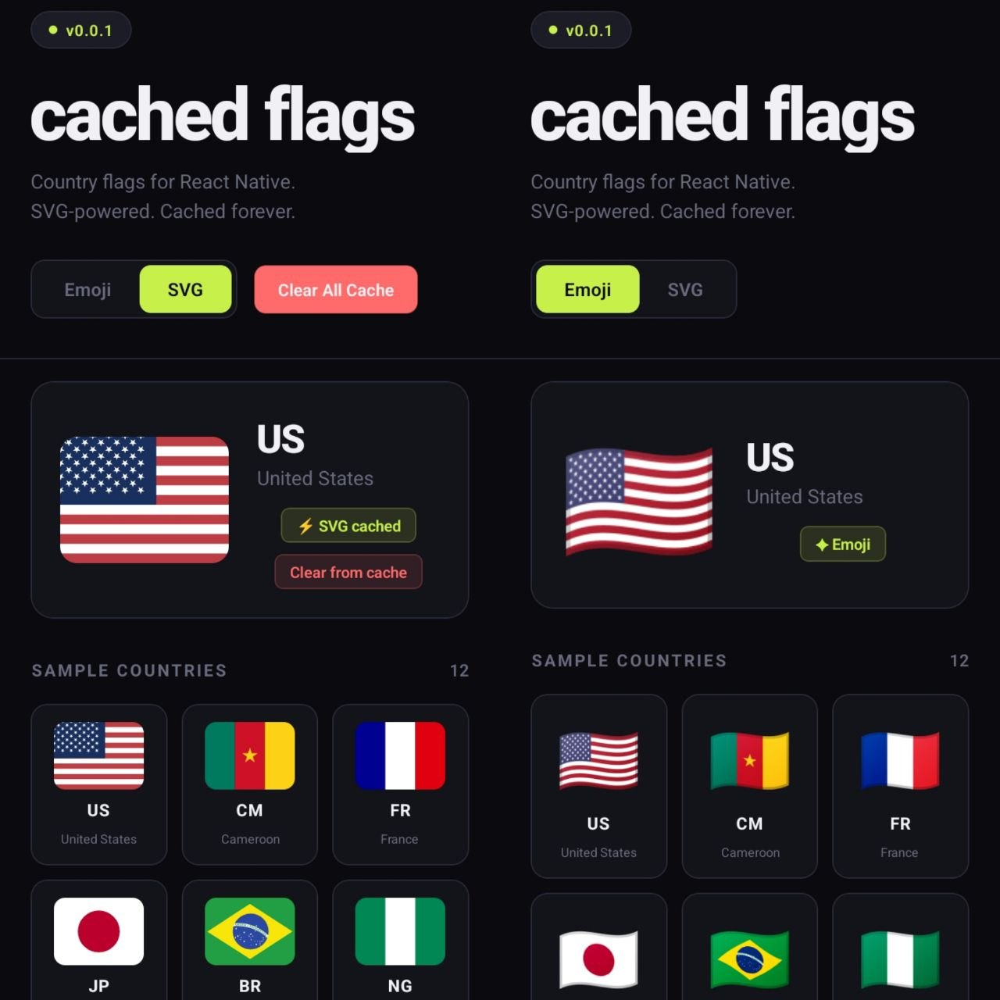

# react-native-cached-flags

React Native country flag component with emoji fallback and **persistent SVG caching**.

Flags fetched as SVGs are saved to device storage — so the network is only hit
once per flag, ever. Subsequent renders are instant, even after app restarts.



---

## Installation

```bash
npm install react-native-cached-flags
```

### Peer dependencies

```bash
npm install react-native-svg @react-native-async-storage/async-storage
```

> For Expo projects use `npx expo install` to get compatible versions.

---

## Usage

### Emoji mode (default)

Zero network requests. Renders the platform emoji for the country.

```tsx
import { CountryFlag } from 'react-native-cached-flags';

<CountryFlag isoCode="CM" size={32} />;
```

### SVG mode (cached)

Fetches once, caches permanently. Instant on every subsequent render.

```tsx
<CountryFlag isoCode="CM" size={32} useSvg />
```

### Custom aspect ratio

```tsx
<CountryFlag isoCode="CM" size={32} useSvg aspectRatio="1:1" />
```

### Offline fallback

Show an emoji instead of a placeholder when the device is offline
and the flag hasn't been cached yet:

```tsx
<CountryFlag isoCode="CM" size={32} useSvg useFallbackEmoji />
```

## Props

| Prop               | Type              | Default     | Description                                         |
| ------------------ | ----------------- | ----------- | --------------------------------------------------- |
| `isoCode`          | `string`          | —           | ISO 3166-1 alpha-2 code e.g. `"US"`, `"CM"`, `"FR"` |
| `size`             | `number`          | —           | Width in dp — height derived from aspect ratio      |
| `useSvg`           | `boolean`         | `false`     | Use SVG with persistent cache instead of emoji      |
| `aspectRatio`      | `'4:3' \| '1:1' ` | `'4:3'`     | Aspect ratio of the rendered flag                   |
| `useFallbackEmoji` | `boolean`         | `false`     | Show emoji if offline and flag not cached           |
| `placeholderColor` | `string`          | `"#E5E7EB"` | Background shown while SVG is loading               |
| `borderRadius`     | `number`          | `0`         | Corner radius on the flag container                 |
| `testID`           | `string`          | —           | Test ID for automated testing                       |

---

## Offline behaviour

| Scenario            | `useFallbackEmoji` | Result                       |
| ------------------- | ------------------ | ---------------------------- |
| Cache hit           | any                | SVG renders instantly        |
| Cache miss, online  | any                | Fetches, caches, renders SVG |
| Cache miss, offline | `false`            | Dashed placeholder shown     |
| Cache miss, offline | `true`             | Emoji fallback rendered      |
| HTTP error          | any                | Default grey SVG shown       |

---

## Cache utilities

```tsx
import {
  clearFlagCache,
  clearAllFlagCache,
  getCachedFlagsCount,
  getCacheSizeKB,
  getNetworkFetchCount,
  resetNetworkFetchCount,
} from 'react-native-cached-flags';

// Remove a single country from cache
await clearFlagCache('CM');

// Clear everything
await clearAllFlagCache();

// Cache stats
const count = await getCachedFlagsCount(); // number of cached flags
const size = await getCacheSizeKB(); // total cache size in KB

// Network stats (resets on app restart)
const fetches = getNetworkFetchCount(); // how many network requests were made
resetNetworkFetchCount(); // reset the counter
```

---

## How caching works

```
First render        →  cache miss  →  fetch from CDN  →  save to AsyncStorage
All future renders  →  cache hit   →  render instantly (no network)
After app restart   →  cache hit   →  still instant (persisted to disk)
Offline, no cache   →  show placeholder or emoji fallback (never caches failures)
```

SVG flags are sourced from [flagicons.lipis.dev](https://flagicons.lipis.dev) —
all flags share a consistent aspect ratio so they align perfectly side by side.

---

## Changelog

### [0.2.0] — 2026

- Added `aspectRatio` prop (`'4:3' | '1:1'`)
- Added `useFallbackEmoji` prop for offline graceful degradation
- Fixed: network failures no longer cache the default SVG (flags retry correctly when back online)
- Improved offline state — shows a dashed placeholder instead of a blank white SVG
- Cache keys now include aspect ratio (`cm_4x3`, `cm_1x1`) so different ratios are stored separately

### [0.1.0]

- Added cache inspection utilities: `getCachedFlagsCount`, `getCacheSizeKB`
- Added network tracking: `getNetworkFetchCount`, `resetNetworkFetchCount`
- Improved `clearAllFlagCache` to use `multiRemove` for batch efficiency

### [0.0.1]

- Initial release
- `CountryFlag` component with emoji and SVG modes
- Persistent SVG caching via AsyncStorage
- `clearFlagCache`, `clearAllFlagCache` utilities

---

## License

MIT © [SiandjaRemy](https://github.com/SiandjaRemy)
