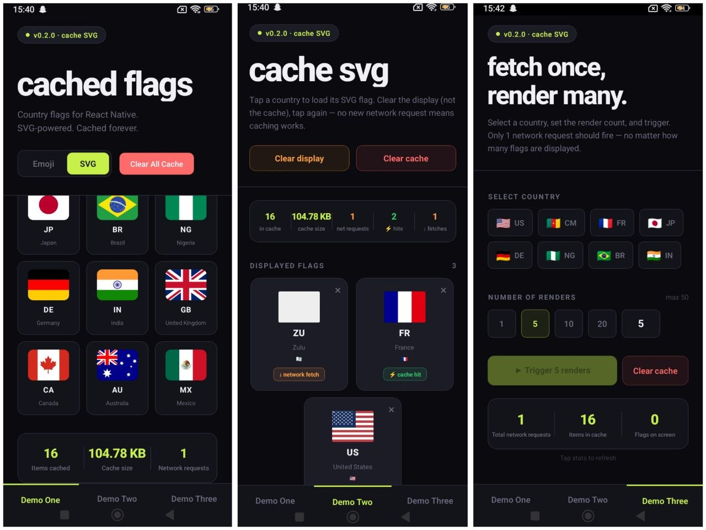

<div align="center">

# 🇨🇲 react-native-cached-flags

[](https://www.npmjs.com/package/react-native-cached-flags)
[](https://www.npmjs.com/package/react-native-cached-flags)
[](https://github.com/SiandjaRemy/react-native-cached-flags/blob/main/LICENSE)
[](https://github.com/SiandjaRemy/react-native-cached-flags)
[](https://bundlephobia.com/package/react-native-cached-flags)
[](http://makeapullrequest.com)

**Zero runtime dependencies. Persistent SVG caching. Request deduplication.**

Country flags for React Native — emoji or SVG, always fast.

</div>



---

## Why this package?

Most flag packages either render emojis (fast but low quality) or fetch SVGs (great quality but wasteful). This package does both — and caches aggressively:

- **Emoji mode** — zero network requests, instant render
- **SVG mode** — fetches once, stores to device storage permanently, never hits the network again for that flag
- **Deduplication** — rendering 50 of the same flag simultaneously fires exactly 1 network request
- **Zero runtime dependencies** — emoji generation is built-in, no extra packages pulled into your app

---

## Installation

```bash
# npm
npm install react-native-cached-flags

# yarn
yarn add react-native-cached-flags

# bun
bun add react-native-cached-flags
```

### Peer dependencies

```bash
npm install react-native-svg @react-native-async-storage/async-storage
```

> For Expo projects use `npx expo install` to get compatible versions.

---

## Usage

### Emoji mode (default)

Zero network requests. Renders the platform emoji for the country.
Accepts ISO 3166-1 alpha-2 codes, IETF language tags, and ISO subdivision codes.

```tsx
import { CountryFlag } from 'react-native-cached-flags';

// ISO 3166-1 alpha-2
<CountryFlag isoCode="CM" size={32} />

// IETF language tag
<CountryFlag isoCode="en-US" size={32} />

// ISO subdivision (renders parent country flag)
<CountryFlag isoCode="GB-SCT" size={32} />
```

### SVG mode (cached)

Fetches once, caches permanently to device storage. Instant on every subsequent
render — even after app restarts.

```tsx
<CountryFlag isoCode="CM" size={32} useSvg />
```

### Custom aspect ratio

```tsx
<CountryFlag isoCode="CM" size={32} useSvg aspectRatio="1:1" />
```

### Offline fallback

Show an emoji instead of a placeholder when offline and the flag is not yet cached:

```tsx
<CountryFlag isoCode="CM" size={32} useSvg useFallbackEmoji />
```

### Cache TTL

Flags rarely change, but they do occasionally. Set an expiry to ensure
stale flags are eventually refreshed:

```tsx
<CountryFlag isoCode="CM" size={32} useSvg cacheTTLDays={90} />
```

### Disable caching

Always fetch a fresh flag while still deduplicating simultaneous requests:

```tsx
<CountryFlag isoCode="CM" size={32} useSvg disableCache />
```

### Load and error callbacks

```tsx
<CountryFlag
  isoCode="CM"
  size={32}
  useSvg
  onLoad={() => console.log('Flag ready')}
  onError={(message) => console.error('Flag failed:', message)}
/>
```

### Preload flags before rendering

Warm the cache ahead of time — ideal for onboarding flows and country pickers:

```tsx
import { preloadFlags } from 'react-native-cached-flags';

await preloadFlags(['US', 'CM', 'FR', 'DE', 'JP'], {
  aspectRatio: '4:3',
  ttlDays: 30,
});
// All flags are now cached — rendering will be instant
```

---

## Props

| Prop               | Type                        | Default     | Description                                                       |
| ------------------ | --------------------------- | ----------- | ----------------------------------------------------------------- |
| `isoCode`          | `string`                    | —           | ISO 3166-1 alpha-2, IETF tag (`en-US`), or subdivision (`GB-SCT`) |
| `size`             | `number`                    | —           | Width in dp — height derived from aspect ratio                    |
| `useSvg`           | `boolean`                   | `false`     | Use SVG with persistent cache instead of emoji                    |
| `aspectRatio`      | `'4:3' \| '1:1'`            | `'4:3'`     | Aspect ratio of the rendered flag                                 |
| `useFallbackEmoji` | `boolean`                   | `false`     | Show emoji if offline and flag not yet cached                     |
| `cacheTTLDays`     | `number`                    | `undefined` | Days before a cached flag expires and is re-fetched               |
| `disableCache`     | `boolean`                   | `false`     | Skip cache — always fetch fresh (deduplication still applies)     |
| `placeholderColor` | `string`                    | `'#E5E7EB'` | Background color shown while SVG is loading                       |
| `borderRadius`     | `number`                    | `0`         | Corner radius on the flag container                               |
| `onLoad`           | `() => void`                | —           | Called when SVG renders successfully                              |
| `onError`          | `(message: string) => void` | —           | Called when flag fails to load, with error description            |
| `testID`           | `string`                    | —           | Test ID for automated testing                                     |

---

## Accepted `isoCode` formats

| Format             | Example                         | Result                     |
| ------------------ | ------------------------------- | -------------------------- |
| ISO 3166-1 alpha-2 | `"US"`, `"CM"`, `"FR"`          | Direct match               |
| IETF language tag  | `"en-US"`, `"pt-BR"`, `"zh-CN"` | Region subtag extracted    |
| ISO subdivision    | `"GB-SCT"`, `"GB-ENG"`          | Parent country used (`🇬🇧`) |
| Bare language tag  | `"pl"`, `"en"`                  | Falls back to `🏳️`         |

---

## Offline behaviour

| Scenario            | `useFallbackEmoji` | Result                        |
| ------------------- | ------------------ | ----------------------------- |
| Cache hit           | any                | SVG renders instantly         |
| Cache miss, online  | any                | Fetch once, cache, render SVG |
| Cache miss, offline | `false`            | Dashed placeholder shown      |
| Cache miss, offline | `true`             | Emoji fallback rendered       |
| HTTP error          | any                | Default grey SVG shown        |

---

## Request deduplication

Rendering the same flag multiple times simultaneously triggers only **one**
network request. All instances share the in-flight promise and render together
when it resolves.

```tsx
// 50 renders → exactly 1 network request
{
  Array.from({ length: 50 }).map((_, i) => (
    <CountryFlag key={i} isoCode="CM" size={32} useSvg />
  ));
}
```

---

## Cache utilities

```tsx
import {
  preloadFlags,
  clearFlagCache,
  clearAllFlagVariants,
  clearAllFlagCache,
  getCachedFlagsCount,
  getCacheSizeKB,
  getNetworkFetchCount,
  resetNetworkFetchCount,
} from 'react-native-cached-flags';

// Preload a set of flags into cache before rendering
await preloadFlags(['US', 'CM', 'FR'], { aspectRatio: '4:3', ttlDays: 30 });

// Remove one flag for a specific aspect ratio
await clearFlagCache('CM', '4:3');

// Remove all cached variants of a flag (all aspect ratios)
await clearAllFlagVariants('CM');

// Clear the entire cache
await clearAllFlagCache();

// Cache stats
const count = await getCachedFlagsCount(); // number of flags currently cached
const size = await getCacheSizeKB(); // total cache size in KB

// Network request tracking (resets on app restart)
const fetches = getNetworkFetchCount();
resetNetworkFetchCount();
```

---

## `useCacheStats` hook

Reactive hook that automatically reflects cache state. Eliminates manual
refresh calls.

```tsx
import { useCacheStats } from 'react-native-cached-flags';

// Manual refresh (Recommended)
const { count, sizeKB, fetchCount, loading, refresh } = useCacheStats();

// Auto-polling every 2 seconds
const { count, sizeKB, fetchCount } = useCacheStats({ pollIntervalMs: 2000 });

// With clearAndRefresh helper
const { clearAndRefresh } = useCacheStats();
await clearAndRefresh('CM'); // clears all CM variants and refreshes stats
```

| Field             | Type                                 | Description                              |
| ----------------- | ------------------------------------ | ---------------------------------------- |
| `count`           | `number`                             | Number of flags currently in cache       |
| `sizeKB`          | `number`                             | Total cache size in KB                   |
| `fetchCount`      | `number`                             | Network requests made this session       |
| `loading`         | `boolean`                            | Whether stats are being loaded           |
| `refresh`         | `() => Promise<void>`                | Manually trigger a stats refresh         |
| `clearAndRefresh` | `(isoCode: string) => Promise<void>` | Clear all variants of a flag and refresh |

---

## Emoji generation

Flag emojis are generated natively — no external dependency required.
Uses Unicode regional indicator symbols (`U+1F1E6`–`U+1F1FF`).

```tsx
import {
  countryCodeToFlagEmoji,
  extractCountryCode,
} from 'react-native-cached-flags';

countryCodeToFlagEmoji('US'); // '🇺🇸'
countryCodeToFlagEmoji('en-US'); // '🇺🇸'
countryCodeToFlagEmoji('GB-SCT'); // '🇬🇧'
countryCodeToFlagEmoji('pl'); // null

extractCountryCode('en-US'); // 'US'
extractCountryCode('GB-SCT'); // 'GB'
extractCountryCode('pl'); // null
```

---

## How caching works

```
First render         →  cache miss   →  fetch from CDN  →  save to AsyncStorage
Simultaneous renders →  deduplicated →  1 fetch shared across all instances
All future renders   →  cache hit    →  instant, no network
After app restart    →  cache hit    →  still instant (persisted to disk)
TTL expired          →  cache miss   →  re-fetches fresh copy from CDN
disableCache=true    →  skip cache   →  always fresh, still deduplicated
Offline, no cache    →  placeholder or emoji fallback (failures never cached)
```

SVG flags are sourced from [flagicons.lipis.dev](https://flagicons.lipis.dev) —
all flags share a consistent aspect ratio so they align perfectly side by side.

---

## Changelog

### [1.1.0]

- Removed `country-code-to-flag-emoji` dependency — zero runtime dependencies
- Built-in emoji generation from Unicode regional indicator symbols
- Accepts IETF language tags (`en-US`, `pt-BR`) and ISO subdivision codes (`GB-SCT`)
- Added `disableCache` prop — always fetch fresh while deduplication still applies
- Added `clearAllFlagVariants` utility — remove all aspect ratio variants for one flag
- Added `useCacheStats` hook with optional polling and `clearAndRefresh` helper
- Fixed cache key double-building bug (cache now works correctly for all aspect ratios)
- Fixed `clearAllFlagVariants` case sensitivity bug

### [1.0.0]

- Added request deduplication — N simultaneous renders trigger exactly 1 network request
- Added `cacheTTLDays` prop — optional cache expiry in days
- Added `onLoad` and `onError` callback props
- Added `preloadFlags` utility for warming the cache ahead of rendering
- Cache storage format updated to JSON payload with timestamp for TTL support
- Backward compatible with caches from v0.x
- First stable release

### [0.2.0]

- Added `aspectRatio` prop (`'4:3' | '1:1'`)
- Added `useFallbackEmoji` prop for offline graceful degradation
- Fixed: network failures no longer cached permanently
- Offline state shows dashed border placeholder
- Cache keys include aspect ratio

### [0.1.0]

- Added `getCachedFlagsCount`, `getCacheSizeKB`
- Added `getNetworkFetchCount`, `resetNetworkFetchCount`
- Improved `clearAllFlagCache` to use batch `multiRemove`

### [0.0.1]

- Initial release
- `CountryFlag` component with emoji and SVG modes
- Persistent SVG caching via AsyncStorage
- `clearFlagCache`, `clearAllFlagCache`

---

## License

MIT © [SiandjaRemy](https://github.com/SiandjaRemy)
