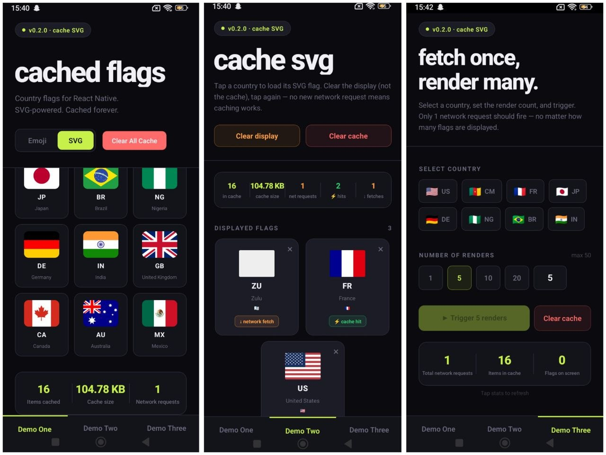

<div align="center">

# 🇨🇲 react-native-cached-flags

[](https://www.npmjs.com/package/react-native-cached-flags)
[](https://www.npmjs.com/package/react-native-cached-flags)
[](https://github.com/SiandjaRemy/react-native-cached-flags/blob/main/LICENSE)
[](https://github.com/SiandjaRemy/react-native-cached-flags)
[](https://bundlephobia.com/package/react-native-cached-flags)
[](http://makeapullrequest.com)

**Zero runtime dependencies. Persistent SVG caching. Request deduplication. Global config.**

Country flags for React Native — emoji or SVG, always fast.

</div>



---

## Why this package?

Most flag packages either render emojis (fast but low quality) or fetch SVGs
(great quality but wasteful). This package does both — and caches aggressively:

- **Emoji mode** — zero network requests, instant render
- **SVG mode** — fetches once, stores to device storage permanently, never hits the network again for that flag
- **Deduplication** — rendering 50 of the same flag simultaneously fires exactly 1 network request
- **Global config** — set defaults once at the app root, override per-instance when needed
- **Zero runtime dependencies** — emoji generation is built-in, no extra packages pulled into your app

---

## Installation

```bash
# npm
npm install react-native-cached-flags

# yarn
yarn add react-native-cached-flags

# bun
bun add react-native-cached-flags
```

### Peer dependencies

```bash
# npm
npm install react-native-svg @react-native-async-storage/async-storage

# yarn
yarn add react-native-svg @react-native-async-storage/async-storage
```

> For Expo projects use `npx expo install` to get compatible versions.

---

## Quick start

```tsx
import { CachedFlagsProvider, CountryFlag } from 'react-native-cached-flags';

// 1. Wrap your app with the provider (optional but recommended)
export default function App() {
  return (
    <CachedFlagsProvider
      config={{
        aspectRatio: '4:3',
        cacheTTLDays: 30,
        useFallbackEmoji: true,
      }}
    >
      <YourApp />
    </CachedFlagsProvider>
  );
}

// 2. Use CountryFlag anywhere — inherits config automatically
<CountryFlag isoCode="CM" size={32} useSvg />;
```

The provider is **optional** — existing usage without it works exactly as before.

---

## Global configuration — `CachedFlagsProvider`

Set app-wide defaults once at the root. Every `CountryFlag` instance inherits
them automatically. Per-instance props always override.

```tsx
import { CachedFlagsProvider } from 'react-native-cached-flags';

// App.tsx / _layout.tsx (Expo Router)
export default function RootLayout() {
  return (
    <CachedFlagsProvider
      config={{
        aspectRatio: '1:1', // all flags square by default
        cacheTTLDays: 30, // refresh monthly
        useFallbackEmoji: true, // show emoji when offline
        placeholderColor: '#F3F4F6', // custom loading color
        borderRadius: 4, // rounded corners everywhere
      }}
    >
      <Stack />
    </CachedFlagsProvider>
  );
}
```

### Custom CDN

For corporate environments or self-hosted flag assets:

```tsx
<CachedFlagsProvider
  config={{
    cdnBaseUrl: 'https://mycdn.company.com/flags/4x3',
  }}
>
  <App />
</CachedFlagsProvider>
```

### Config without a provider

For utilities called outside the React tree (`preloadFlags`, `getFlagUrl`),
set module-level config directly:

```tsx
import { configureCachedFlags } from 'react-native-cached-flags';

// Call once at app startup, before any flag rendering
configureCachedFlags({
  cdnBaseUrl: 'https://mycdn.company.com/flags/4x3',
  aspectRatio: '1:1',
  cacheTTLDays: 30,
});
```

### Config resolution order

```
Per-instance prop        →  highest priority, always wins
    ↓ (if not set)
CachedFlagsProvider      →  app-wide defaults
    ↓ (if no provider)
configureCachedFlags()   →  module-level defaults (for utilities)
    ↓ (if not called)
Built-in defaults        →  aspectRatio: '4:3', disableCache: false, etc.
```

### All configurable options

| Option             | Type             | Default     | Description                                             |
| ------------------ | ---------------- | ----------- | ------------------------------------------------------- |
| `cdnBaseUrl`       | `string`         | lipis CDN   | Base URL for SVG flag assets                            |
| `aspectRatio`      | `'4:3' \| '1:1'` | `'4:3'`     | Default aspect ratio for all flags                      |
| `placeholderColor` | `string`         | `'#E5E7EB'` | Default loading placeholder color                       |
| `borderRadius`     | `number`         | `0`         | Default corner radius                                   |
| `cacheTTLDays`     | `number`         | `undefined` | Default cache expiry in days                            |
| `disableCache`     | `boolean`        | `false`     | Skip cache by default (deduplication still applies)     |
| `useFallbackEmoji` | `boolean`        | `false`     | Show emoji when offline and flag not cached, by default |

---

## `useCachedFlagsConfig` hook

Read the active config from anywhere inside the provider tree. Useful for
building custom components that respect global config without prop threading.

```tsx
import { useCachedFlagsConfig } from 'react-native-cached-flags';

// Read active config
function MyCustomFlag({ isoCode }: { isoCode: string }) {
  const config = useCachedFlagsConfig();

  // Derive layout from configured aspect ratio
  const width = 48;
  const height = config.aspectRatio === '1:1' ? width : width * 0.75;

  return (
    <View style={{ width, height }}>
      <CountryFlag isoCode={isoCode} size={width} useSvg />
    </View>
  );
}

// Debug active config in development
function DevConfigInspector() {
  const config = useCachedFlagsConfig();
  if (!__DEV__) return null;

  return (
    <View>
      {Object.entries(config).map(([key, value]) => (
        <Text key={key}>
          {key}: {String(value ?? 'undefined')}
        </Text>
      ))}
    </View>
  );
}
```

Safe to call without a provider — falls back to module-level or built-in defaults.

---

## Usage

### Emoji mode (default)

Zero network requests. Renders the platform emoji for the country.
Accepts ISO 3166-1 alpha-2 codes, IETF language tags, and ISO subdivision codes.

```tsx
import { CountryFlag } from 'react-native-cached-flags';

// ISO 3166-1 alpha-2
<CountryFlag isoCode="CM" size={32} />

// IETF language tag
<CountryFlag isoCode="en-US" size={32} />

// ISO subdivision (renders parent country flag)
<CountryFlag isoCode="GB-SCT" size={32} />
```

### SVG mode (cached)

Fetches once, caches permanently to device storage. Instant on every subsequent
render — even after app restarts.

```tsx
<CountryFlag isoCode="CM" size={32} useSvg />
```

### Custom aspect ratio

```tsx
<CountryFlag isoCode="CM" size={32} useSvg aspectRatio="1:1" />
```

### Offline fallback

Show an emoji instead of a placeholder when offline and the flag is not yet cached:

```tsx
<CountryFlag isoCode="CM" size={32} useSvg useFallbackEmoji />
```

### Cache TTL

Flags rarely change, but they do occasionally. Set an expiry to ensure
stale flags are eventually refreshed:

```tsx
<CountryFlag isoCode="CM" size={32} useSvg cacheTTLDays={90} />
```

### Disable caching

Always fetch a fresh flag while still deduplicating simultaneous requests:

```tsx
<CountryFlag isoCode="CM" size={32} useSvg disableCache />
```

### Load and error callbacks

```tsx
<CountryFlag
  isoCode="CM"
  size={32}
  useSvg
  onLoad={() => console.log('Flag ready')}
  onError={(message) => console.error('Flag failed:', message)}
/>
```

### Preload flags before rendering

Warm the cache ahead of time — ideal for onboarding flows and country pickers:

```tsx
import { preloadFlags } from 'react-native-cached-flags';

await preloadFlags(['US', 'CM', 'FR', 'DE', 'JP'], {
  aspectRatio: '4:3',
  ttlDays: 30,
});
```

---

## Props

| Prop               | Type                        | Default            | Description                                                       |
| ------------------ | --------------------------- | ------------------ | ----------------------------------------------------------------- |
| `isoCode`          | `string`                    | —                  | ISO 3166-1 alpha-2, IETF tag (`en-US`), or subdivision (`GB-SCT`) |
| `size`             | `number`                    | —                  | Width in dp — height derived from aspect ratio                    |
| `useSvg`           | `boolean`                   | `false`            | Use SVG with persistent cache instead of emoji                    |
| `aspectRatio`      | `'4:3' \| '1:1'`            | config/`'4:3'`     | Aspect ratio of the rendered flag                                 |
| `useFallbackEmoji` | `boolean`                   | config/`false`     | Show emoji if offline and flag not yet cached                     |
| `cacheTTLDays`     | `number`                    | config/`undefined` | Days before a cached flag expires and is re-fetched               |
| `disableCache`     | `boolean`                   | config/`false`     | Skip cache — always fetch fresh (deduplication still applies)     |
| `placeholderColor` | `string`                    | config/`'#E5E7EB'` | Background color shown while SVG is loading                       |
| `borderRadius`     | `number`                    | config/`0`         | Corner radius on the flag container                               |
| `onLoad`           | `() => void`                | —                  | Called when SVG renders successfully                              |
| `onError`          | `(message: string) => void` | —                  | Called when flag fails to load, with error description            |
| `testID`           | `string`                    | —                  | Test ID for automated testing                                     |

Props marked `config/default` read from `CachedFlagsProvider` or
`configureCachedFlags()` when not set explicitly.

---

## Accepted `isoCode` formats

| Format             | Example                         | Result                     |
| ------------------ | ------------------------------- | -------------------------- |
| ISO 3166-1 alpha-2 | `"US"`, `"CM"`, `"FR"`          | Direct match               |
| IETF language tag  | `"en-US"`, `"pt-BR"`, `"zh-CN"` | Region subtag extracted    |
| ISO subdivision    | `"GB-SCT"`, `"GB-ENG"`          | Parent country used (`🇬🇧`) |
| Bare language tag  | `"pl"`, `"en"`                  | Falls back to `🏳️`         |

---

## Offline behaviour

| Scenario            | `useFallbackEmoji` | Result                        |
| ------------------- | ------------------ | ----------------------------- |
| Cache hit           | any                | SVG renders instantly         |
| Cache miss, online  | any                | Fetch once, cache, render SVG |
| Cache miss, offline | `false`            | Dashed placeholder shown      |
| Cache miss, offline | `true`             | Emoji fallback rendered       |
| HTTP error          | any                | Default grey SVG shown        |

---

## Request deduplication

Rendering the same flag multiple times simultaneously triggers only **one**
network request. All instances share the in-flight promise and render together
when it resolves.

```tsx
// 50 renders → exactly 1 network request
{
  Array.from({ length: 50 }).map((_, i) => (
    <CountryFlag key={i} isoCode="CM" size={32} useSvg />
  ));
}
```

---

## Web & cross-platform usage — `getFlagUrl`

The `CountryFlag` component renders SVGs using `react-native-svg`, which is
native-only. For web contexts — React, Next.js, or any non-native environment —
use `getFlagUrl` to get the CDN URL directly and render it however you need.

```
┌─────────────────────────────────────────────────────────┐
│                                                         │
│   isoCode / IETF tag / subdivision                      │
│            │                                            │
│            ▼                                            │
│      getFlagUrl('CM', { aspectRatio: '4:3' })           │
│            │                                            │
│            ▼                                            │
│   'https://flagicons.lipis.dev/flags/4x3/cm.svg'        │
│            │                                            │
│     ┌──────┴──────────────────────┐                     │
│     │                             │                     │
│     ▼                             ▼                     │
│           <Image src={url} />          │
│  (React / web)             (Next.js)                    │
│                                                         │
└─────────────────────────────────────────────────────────┘
```

```tsx
import { getFlagUrl } from 'react-native-cached-flags';

const url = getFlagUrl('CM'); // '...flags/4x3/cm.svg'
const squareUrl = getFlagUrl('CM', { aspectRatio: '1:1' }); // '...flags/1x1/cm.svg'
const fromTag = getFlagUrl('en-US'); // '...flags/4x3/us.svg'
const fromSub = getFlagUrl('GB-SCT'); // '...flags/4x3/gb.svg'
const invalid = getFlagUrl('pl'); // null — always check!
```

### Platform-conditional pattern

```tsx
import { Platform } from 'react-native';
import { CountryFlag, getFlagUrl } from 'react-native-cached-flags';

function Flag({ isoCode, size }: { isoCode: string; size: number }) {
  if (Platform.OS === 'web') {
    const url = getFlagUrl(isoCode);
    if (!url) return null;
    return (
      
    );
  }
  return <CountryFlag isoCode={isoCode} size={size} useSvg />;
}
```

### Next.js example

```tsx
import Image from 'next/image';
import { getFlagUrl } from 'react-native-cached-flags';

export function FlagImage({ isoCode }: { isoCode: string }) {
  const url = getFlagUrl(isoCode);
  if (!url) return null;
  return <Image src={url} width={40} height={30} alt={`${isoCode} flag`} />;
}
```

> **Note:** `getFlagUrl` returns a URL only — no caching, no deduplication.
> On native, prefer `CountryFlag` with `useSvg` for the full caching benefits.
> On web, your browser's HTTP cache handles repeated requests automatically.

---

## Cache utilities

```tsx
import {
  preloadFlags,
  clearFlagCache,
  clearAllFlagVariants,
  clearAllFlagCache,
  getCachedFlagsCount,
  getCacheSizeKB,
  getNetworkFetchCount,
  resetNetworkFetchCount,
} from 'react-native-cached-flags';

// Preload a set of flags into cache before rendering
await preloadFlags(['US', 'CM', 'FR'], { aspectRatio: '4:3', ttlDays: 30 });

// Remove one flag for a specific aspect ratio
await clearFlagCache('CM', '4:3');

// Remove all cached variants of a flag (all aspect ratios)
await clearAllFlagVariants('CM');

// Clear the entire cache
await clearAllFlagCache();

// Cache stats
const count = await getCachedFlagsCount(); // number of flags currently cached
const size = await getCacheSizeKB(); // total cache size in KB

// Network request tracking (resets on app restart)
const fetches = getNetworkFetchCount();
resetNetworkFetchCount();
```

---

## `useCacheStats` hook

Reactive hook that automatically reflects cache state. Eliminates manual
refresh calls.

```tsx
import { useCacheStats } from 'react-native-cached-flags';

// Manual refresh
const { count, sizeKB, fetchCount, loading, refresh } = useCacheStats();

// Auto-polling every 2 seconds
const { count, sizeKB, fetchCount } = useCacheStats({ pollIntervalMs: 2000 });

// With clearAndRefresh helper
const { clearAndRefresh } = useCacheStats();
await clearAndRefresh('CM'); // clears all CM variants and refreshes stats
```

| Field             | Type                                 | Description                              |
| ----------------- | ------------------------------------ | ---------------------------------------- |
| `count`           | `number`                             | Number of flags currently in cache       |
| `sizeKB`          | `number`                             | Total cache size in KB                   |
| `fetchCount`      | `number`                             | Network requests made this session       |
| `loading`         | `boolean`                            | Whether stats are being loaded           |
| `refresh`         | `() => Promise<void>`                | Manually trigger a stats refresh         |
| `clearAndRefresh` | `(isoCode: string) => Promise<void>` | Clear all variants of a flag and refresh |

---

## Emoji generation

Flag emojis are generated natively — no external dependency required.
Uses Unicode regional indicator symbols (`U+1F1E6`–`U+1F1FF`).

```tsx
import {
  countryCodeToFlagEmoji,
  extractCountryCode,
} from 'react-native-cached-flags';

countryCodeToFlagEmoji('US'); // '🇺🇸'
countryCodeToFlagEmoji('en-US'); // '🇺🇸'
countryCodeToFlagEmoji('GB-SCT'); // '🇬🇧'
countryCodeToFlagEmoji('pl'); // null

extractCountryCode('en-US'); // 'US'
extractCountryCode('GB-SCT'); // 'GB'
extractCountryCode('pl'); // null
```

---

## How caching works

```
First render         →  cache miss   →  fetch from CDN  →  save to AsyncStorage
Simultaneous renders →  deduplicated →  1 fetch shared across all instances
All future renders   →  cache hit    →  instant, no network
After app restart    →  cache hit    →  still instant (persisted to disk)
TTL expired          →  cache miss   →  re-fetches fresh copy from CDN
disableCache=true    →  skip cache   →  always fresh, still deduplicated
Offline, no cache    →  placeholder or emoji fallback (failures never cached)
Web (getFlagUrl)     →  URL only     →  browser HTTP cache handles repeats
```

SVG flags are sourced from [flagicons.lipis.dev](https://flagicons.lipis.dev) —
all flags share a consistent aspect ratio so they align perfectly side by side.

---

## License

MIT © [SiandjaRemy](https://github.com/SiandjaRemy)
